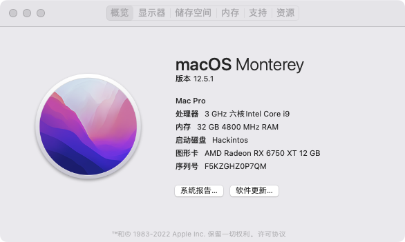
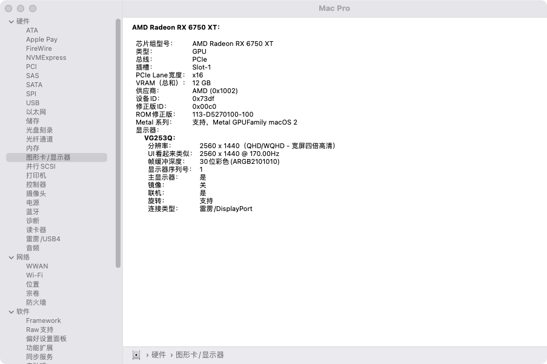

# Asus ROG Strix B660-I + i5-12490F + 6650XT+DDR5
## **Hardware**

| Properties  | Product                           |
| ----------- | --------------------------------- |
| CPU         | Intel  i5 12490F                  |
| Motherboard | Asus ROG Strix B660-I             |
| GPU         | MSI Radeon RX *6650 XT MECH*      |
| 网卡        | Intel Wi-Fi 6 AX201               |
| 硬盘        | PREDATOR *GM7000* 1T              |
| Memory      | Kingston *Fury* *5200MT*/s *DDR5* |
| OC Version  | 0.8.3                             |
| macOS       | macOS Monterey 12.6               |

### **Working**

- Bluetooth, Wi-Fi and LOM ethernet
- AMD GPU HDMI & DP Audio; motherboard 3.5MM audio out
- Sleep / Wake works; mouse / keyboard wakes machine
- USB port mapping is complete

